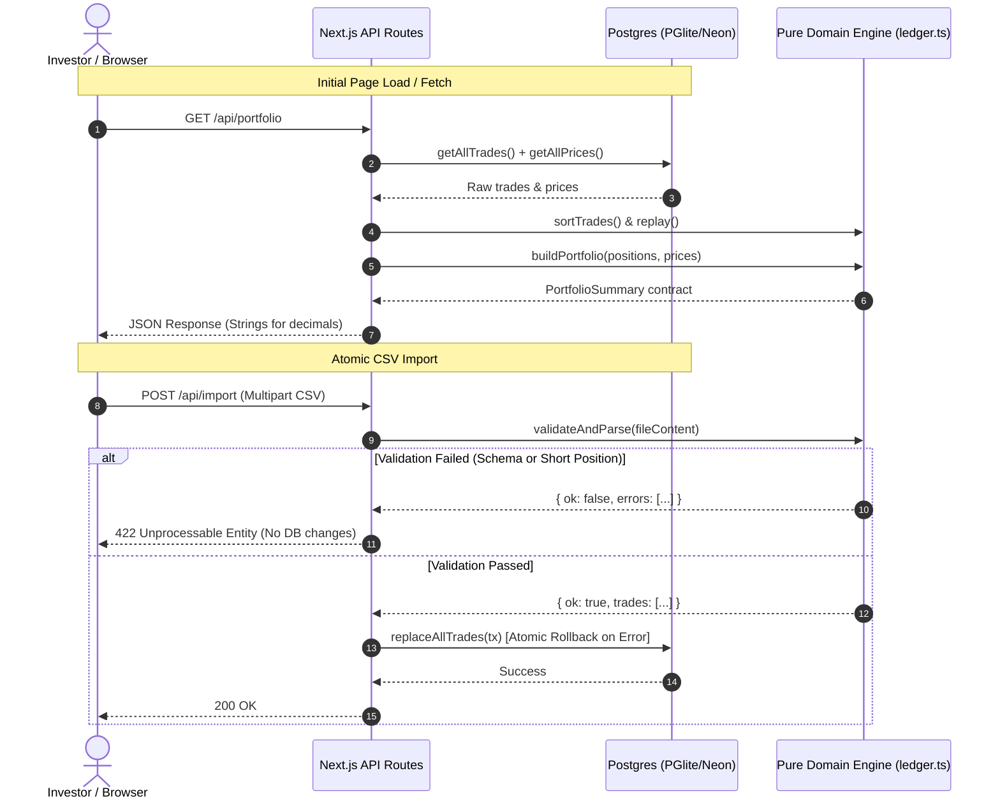

# AI-Assisted Crypto Portfolio Analytics

A production-grade, full-stack cryptocurrency portfolio tracking and analytics platform built with **Next.js 16 (App Router)**, **TypeScript**, **Drizzle ORM**, **PGlite / Neon Postgres**, and **Recharts**.

Designed to track spot crypto trading performance across multiple exchanges with high financial calculation accuracy, atomic CSV imports, server-side transaction querying, and accessible data visualization.

---

## Live Demo & Deployment

- **Live URL**: [https://crypto-portfolio-analysis-ten.vercel.app/](https://crypto-portfolio-analysis-ten.vercel.app/)
- **Source Repository**: [https://github.com/Hoangnam574/Crypto-Portfolio-Analysis](https://github.com/Hoangnam574/Crypto-Portfolio-Analysis)

---

## Key Features

- **6 Headline KPI Cards**: Current Portfolio Value, Cost Basis, Realized P&L, Unrealized P&L, Total P&L, and Total Fees Paid.
- **Accessible Formatting**: Signs (`+` / `−`), directional indicators (`▲` / `▼`), accessible `aria-label` tags, and dual contrast styling so colorblind and screen-reader users can distinguish performance.
- **Holdings Table**: Real-time breakdown of all 5 assets (BTC, ETH, SOL, CKB, DOGE) with 9 metrics per asset plus footer totals reconciling with KPIs.
- **Interactive Visualizations**:
  - *Asset Allocation Donut*: Proportion of total portfolio value held in each active asset.
  - *P&L Distribution Chart*: Grouped bar chart comparing Realized vs. Unrealized P&L per asset with a distinct zero baseline.
- **Server-Side Transaction Explorer**:
  - Filter by Symbol, Exchange, Side, and UTC Date Range.
  - Timestamp sorting (asc/desc) and server-side pagination.
  - Displays all 8 original CSV fields plus gross trade value, fee callout, post-trade quantity, post-trade weighted-average cost, and trade realized P&L.
- **Robust CSV Import Modal**:
  - Drag-and-drop file upload with 1 MB limit and BOM stripping.
  - Atomic all-or-nothing database updates via Postgres transactions.
  - Returns up to 50 structured validation errors with exact row, column, rejected value, error reason, and actionable fix hint.
  - One-click **Reset to Sample Data** button with user confirmation.

---

## Local Setup & Getting Started

### Prerequisites

- Node.js >= 20.x
- npm >= 10.x
- Python 3.x (optional, for running the independent Decimal reference oracle)

### 1. Installation

Clone the repository and install dependencies:

```bash
git clone <repo-url>
cd NFT
npm install
```

### 2. Environment Variables

Create a `.env` file based on `.env.example`:

```bash
cp .env.example .env
```

| Variable | Description | Default |
|---|---|---|
| `DATABASE_URL` | Neon Postgres connection URI (`postgresql://...`) | Optional for local dev. If omitted, the app automatically initializes an embedded **PGlite** database stored in `./.data/pglite`. |

> **Note on Zero-Config Local Dev**: You do **not** need a running external PostgreSQL or Docker instance to test locally. If `DATABASE_URL` is omitted, the app automatically initializes an embedded WebAssembly-based Postgres (`PGlite`) instance and auto-seeds the 200 sample trades and 5 asset prices on first boot.

### 3. Available Commands

```bash
# Start local development server (http://localhost:3000)
npm run dev

# Run full automated test suite (51 tests: domain, import, golden oracle, db rollback, API)
npm test

# Run tests in watch mode
npm run test:watch

# Execute production build and TypeScript verification
npm run build

# Start production server
npm start

# Manual database seed from CSV files in /data
npm run db:seed
```

---

## Architecture & Data Flow

The project strictly separates domain logic from infrastructure, storage, and presentation.

```
┌────────────────────────────────────────────────────────┐
│                   Next.js Presentation                 │
│   src/app/page.tsx  •  globals.css  •  layout.tsx       │
└──────────────────────────┬─────────────────────────────┘
                           │ HTTP / JSON
┌──────────────────────────▼─────────────────────────────┐
│                    API Route Layer                     │
│  /api/portfolio • /api/trades • /api/import • /reset   │
└────────────┬─────────────────────────────┬─────────────┘
             │                             │
┌────────────▼────────────┐   ┌────────────▼─────────────┐
│      Pure Domain        │   │    Database Layer        │
│  src/domain/money.ts    │   │  src/db/schema.ts        │
│  src/domain/ledger.ts   │   │  src/db/client.ts        │
│  src/domain/portfolio.ts│   │  src/db/repository.ts    │
│  src/import/validate.ts │   │  src/db/seed.ts          │
└─────────────────────────┘   └──────────────────────────┘
```

### Module Boundaries

1. **`src/domain/` (Pure Domain)**:
   - Zero dependencies on React, Next.js, or SQL drivers.
   - Contains all financial math, ledger replay logic, and portfolio aggregation.
   - All monetary arithmetic uses `decimal.js` with precision 40.
2. **`src/import/` (Validation Pipeline)**:
   - Validates CSV headers, data types, timestamp formats, and verifies that chronological trade execution never causes a negative (short) position.
3. **`src/db/` (Persistence & Drivers)**:
   - `client.ts`: The **only** place that selects the DB driver (Neon WebSocket Pool in production, PGlite locally, in-memory PGlite for tests).
   - `repository.ts`: Pure data access layer receiving a Drizzle DB instance. Executes batch deletes and inserts inside a single database transaction.

### Data Flow Diagram



---

## Financial Calculation Methodology

Calculations adhere strictly to the project specification for **Weighted-Average Cost Basis**.

Transactions across Binance and Coinbase are aggregated into a single unified position per asset, ordered chronologically by `timestamp` ascending (with file row number `seq` as a deterministic tie-breaker for identical timestamps).

### 1. BUY Transactions

- **Gross Value**:
  $$\text{Gross Value} = \text{Quantity} \times \text{Price USD}$$

- **Cost Added**:
  $$\text{Cost Added} = \text{Gross Value} + \text{Fee USD}$$
  *(BUY fees are capitalized into cost basis)*

- **New Quantity**:
  $$\text{New Quantity} = \text{Previous Quantity} + \text{Bought Quantity}$$

- **New Total Cost**:
  $$\text{New Total Cost} = \text{Previous Cost} + \text{Cost Added}$$

- **Weighted Average Cost (WAC)**:
  $$\text{Avg Cost} = \frac{\text{New Total Cost}}{\text{New Quantity}}$$

---

### 2. SELL Transactions

- **Gross Value**:
  $$\text{Gross Value} = \text{Quantity} \times \text{Price USD}$$

- **Net Proceeds**:
  $$\text{Net Proceeds} = \text{Gross Value} - \text{Fee USD}$$
  *(SELL fees reduce proceeds)*

- **Cost Basis of Sold Units**:
  $$\text{Cost Basis Removed} = \text{Avg Cost Before} \times \text{Sold Quantity}$$

- **Realized P&L**:
  $$\text{Realized PnL} = \text{Net Proceeds} - \text{Cost Basis Removed}$$

- **Position Updates**:
  - $\text{Remaining Quantity} = \text{Previous Quantity} - \text{Sold Quantity}$
  - $\text{Remaining Cost} = \text{Previous Cost} - \text{Cost Basis Removed}$
  - If $\text{Remaining Quantity} > 0$: $\text{Avg Cost} = \frac{\text{Remaining Cost}}{\text{Remaining Quantity}}$

---

### 3. Full Position Close & Zero-Balance Reset

- When $\text{Remaining Quantity} = 0$:
  - Explicit reset: $\text{Total Cost} = 0$, $\text{Avg Cost} = 0$.
  - Any subsequent BUY starts fresh from zero without carrying legacy cost basis dust.

---

### 4. Current Valuation & Portfolio Metrics

- **Current Value**:
  $$\text{Current Value} = \text{Quantity} \times \text{Current Price}$$

- **Unrealized P&L**:
  $$\text{Unrealized PnL} = \text{Current Value} - \text{Cost Basis}$$

- **Total P&L**:
  $$\text{Total PnL} = \text{Realized PnL} + \text{Unrealized PnL}$$

- **Portfolio Allocation (%)**:
  $$\text{Allocation} = \frac{\text{Asset Current Value}}{\text{Portfolio Current Value}} \times 100\%$$
  *(Safely returns 0% if portfolio value is 0)*

- **Total Fees**:
  $$\text{Total Fees} = \sum \text{BUY Fees} + \sum \text{SELL Fees}$$

---

## Precision & Rounding Policy

Floating-point inaccuracies (e.g. `0.1 + 0.2 !== 0.3`) are unacceptable in financial systems, especially given micro-quantity assets (BTC ~0.006) alongside high-quantity assets (CKB ~1.79 million).

1. **Pure Decimal Domain**:
   - `Decimal.set({ precision: 40 })` configured in `src/domain/money.ts`.
   - Never converts numbers to JavaScript `number` during ledger replay or portfolio aggregation.
2. **Database Storage**:
   - PostgreSQL schema uses `NUMERIC(38, 18)` for quantities, prices, and fees, preserving exact satoshi-level precision.
3. **Serialization Boundary**:
   - All numeric values transmitted over HTTP/JSON APIs are serialized as exact strings.
4. **Display Rounding (UI Only)**:
   - Fiat values (Value, Cost Basis, Realized, Unrealized, Fees): formatted to 2 decimal places with comma separation.
   - Prices below $1.00: formatted up to 8 significant digits (e.g. CKB at `$0.01524100`).
   - Quantities: trimmed of trailing zeros, displaying up to 8 decimal places.
   - - P&L Percentages: formatted as $(\frac{\text{PnL}}{\text{Cost Basis}}) \times 100\%$ with 2 decimals; displays - if cost basis is 0.

---

## Data Import & Validation Pipeline

The import pipeline (`src/import/validate.ts`) enforces a 4-stage validation before touching the database:

1. **File Checks**: Max 1 MB, UTF-8 BOM removal, whitespace trimming, header completeness verification.
2. **Field Schema Validation (Zod & Regex)**:
   - Valid UTC ISO-8601 timestamps (must end with `Z` or `+00:00`).
   - Strict enum checks: `Binance` or `Coinbase`; `BUY` or `SELL`; `BTC`, `ETH`, `SOL`, `CKB`, `DOGE`.
   - Standard numeric notation: prohibits `NaN`, `Infinity`, or scientific notation (`1e-5`).
   - `quantity > 0`, `price_usd > 0`, `fee_usd >= 0`.
3. **Identifier Deduplication**: Detects duplicate `trade_id` occurrences and cites both the duplicate and original row.
4. **Chronological Replay & Short-Selling Check**:
   - Simulates trade replay in sorted `(timestamp, seq)` order.
   - If a SELL exceeds the available quantity at that point in time, throws `SHORT_POSITION` with exact line number, available balance, and attempted sell quantity.
5. **Atomic All-or-Nothing Commit**:
   - If any validation error is detected, the entire upload is rejected (HTTP 422), returning a structured error list with actionable remediation hints. Existing database records remain untouched.

---

## Testing & Verification

The project includes 5 automated test suites with **51 tests** running via Vitest:

```bash
npm test
```

### Test Breakdown

| Suite | File | Tests | Coverage |
|---|---|:---:|---|
| **Domain Unit Tests** | `tests/domain.test.ts` | 14 | Multiple BUYs at varying prices, fee capitalization, partial SELL, fee deduction, full close + reopen, short position rejection, zero-division guards. |
| **Import Validation Tests** | `tests/import.test.ts` | 16 | Missing headers, invalid symbols, bad timestamps, negative fees, scientific notation rejection, duplicate IDs, short position detection during replay. |
| **Golden Oracle Comparison** | `tests/golden.test.ts` | 4 | Replays the full 200 trades against `scripts/oracle.py` (Python `Decimal` precision 50). Verifies every single asset position, total, and all 200 per-trade snapshots to **$10^{-20}$** tolerance. |
| **Persistence & Rollback** | `tests/repository.test.ts` | 6 | In-memory PGlite testing, atomic batch replacement, rollback preservation when transactions fail mid-stream, query filtering, pagination, and sorting. |
| **API Integration Tests** | `tests/api.test.ts` | 11 | Direct route handler tests for `/api/health`, `/api/portfolio`, `/api/trades` (400 validation on bad params), `/api/import` (400/422/200), and `/api/reset`. |

---

## Assumptions, Limitations & Tradeoffs

1. **Unified Exchange Scope**:
   - *Decision*: Trades across Binance and Coinbase are aggregated into a single unified position per asset per project instructions.
   - *Tradeoff*: Asset transfers between exchanges do not exist in the data model; arbitrage between exchanges is realized upon sale.
2. **Missing Market Prices**:
   - *Decision*: If an asset has an open quantity but no price entry in `prices.csv`, its value is not guessed. It is excluded from current portfolio valuation and a prominent yellow warning banner is surfaced to the user. Realized P&L from historical closed trades remains included.
3. **Database Driver Strategy**:
   - *Decision*: Dual-driver architecture isolated inside `client.ts`. Embedded PGlite enables friction-free local development with zero external configuration, while Neon Serverless Pool supports production deployments on serverless runtimes.
4. **Client Replay for Explorer**:
   - *Decision*: In order to display instantaneous post-trade snapshots (cumulative quantity, average cost at that moment in time), the server replays ordered trades and matches snapshots to paginated DB rows.
   - *Tradeoff*: Excellent for hundreds or thousands of trades. For millions of trades, pre-computed ledger snapshot tables with database triggers or event-sourcing materialized views would be preferred.

---

## Future Improvements

1. **Real-Time Price WebSockets**: Connect live price feeds (Binance / Coinbase public WebSockets) to update portfolio valuation in real-time.
2. **Tax-Lot Selection**: Support FIFO, LIFO, and Specific Identification methods in addition to Weighted-Average Cost.
3. **Multi-Currency Support**: Expand beyond USD to support EUR, GBP, and native crypto quote pairs (e.g. ETH/BTC).
4. **CSV Export**: Allow users to download transaction explorer tables with computed snapshots and tax summaries as CSV.
